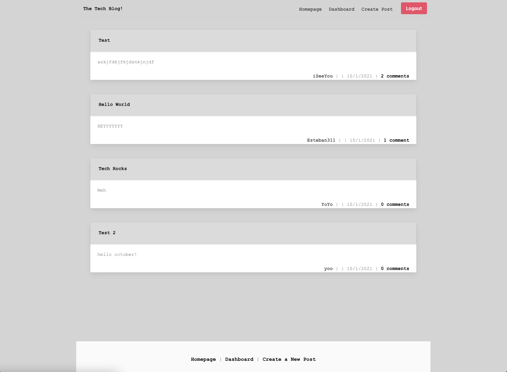

# tech-blog
Model-View-Controller (MVC) Challenge: Tech Blog

## Discription
A CMS-style blog site similar to a Wordpress site, where developers can publish their blog posts and comment on other developers’ posts as well. 

## Screenshot

## Demo
[Live Demo](https://tee-tech-blog.herokuapp.com/login)

## How to Use

1. Clone the repo
2. Create `.env` at the root of directory
*  `DB_NAME=`
*  `DB_USER=`
*  `DB_PW= `

3. Install dependencies with `npm i`
4. Run `npm start` to run the server

## Contributors
Github: [Tima Nlemvo](https://github.com/timanlemvo)

## Questions
Github: [Tima Nlemvo](https://github.com)  
Email: [Tima Nlemvo](timanlemvo@gmail.com)

“Whether you want to uncover the secrets of the universe, or you just want to pursue a career in the 21st century, basic computer programming is an essential skill to learn.”

-- Stephen Hawking 
